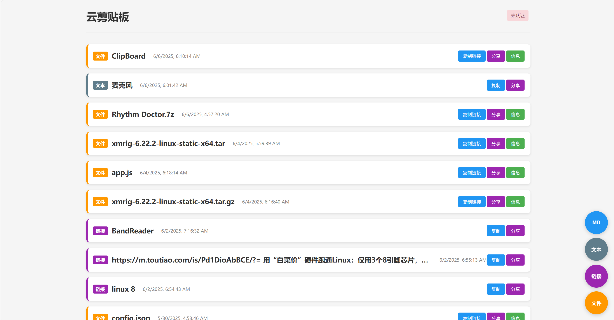
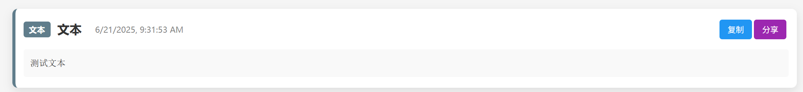
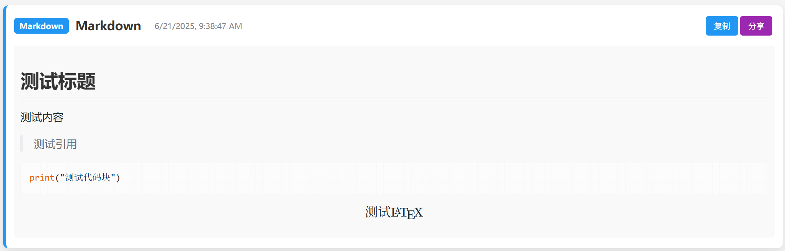
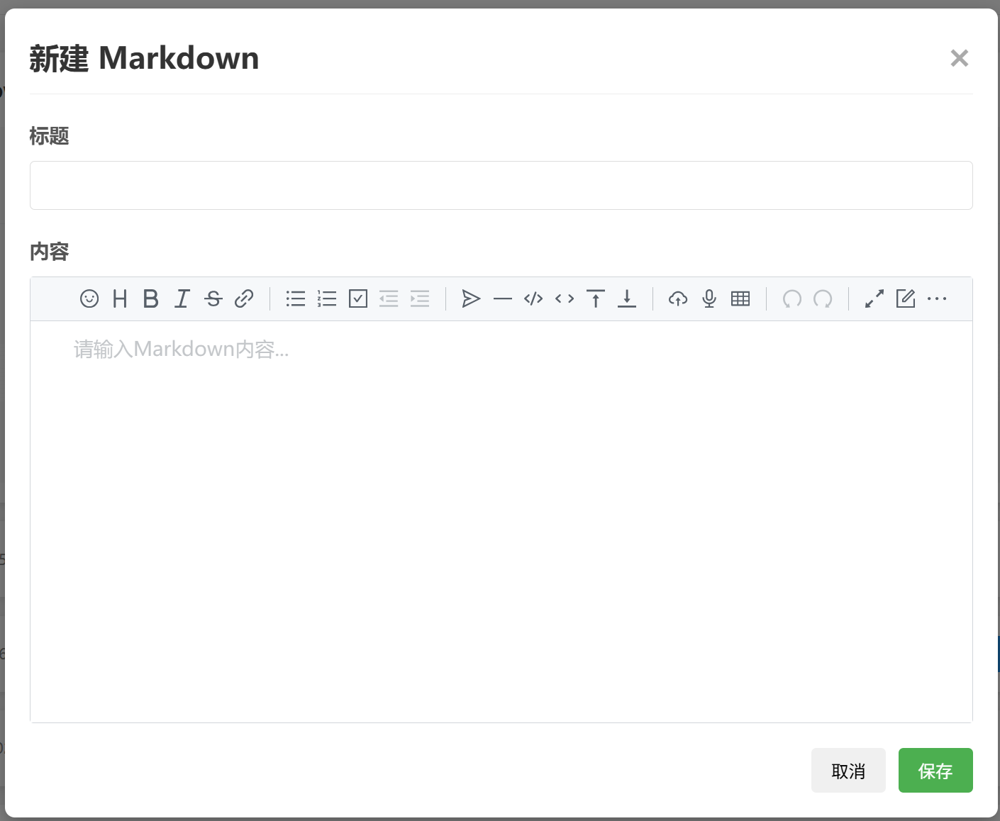
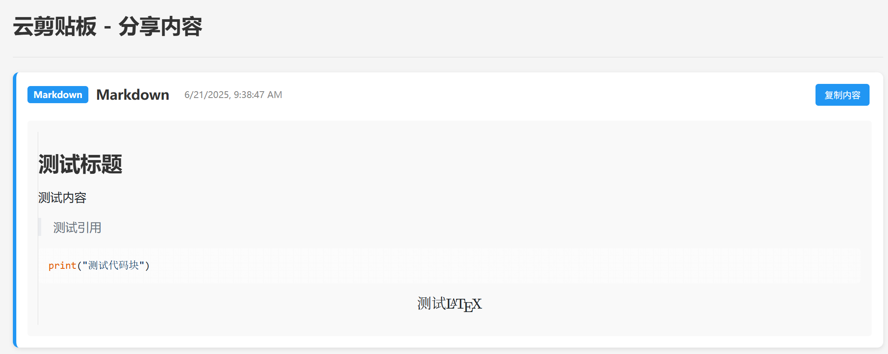
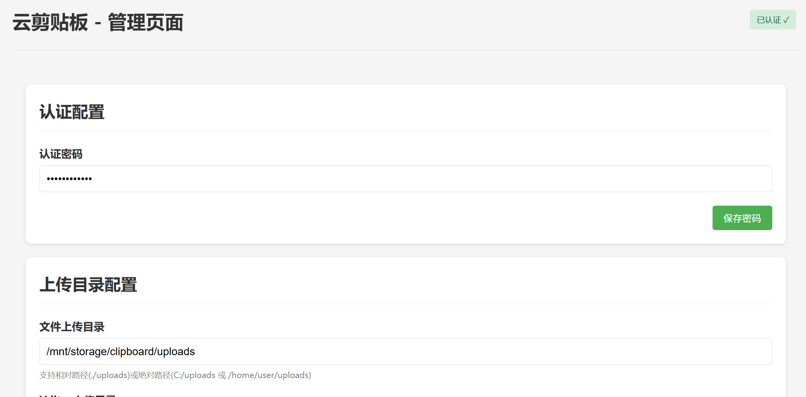
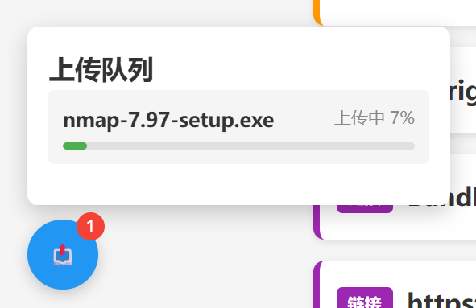
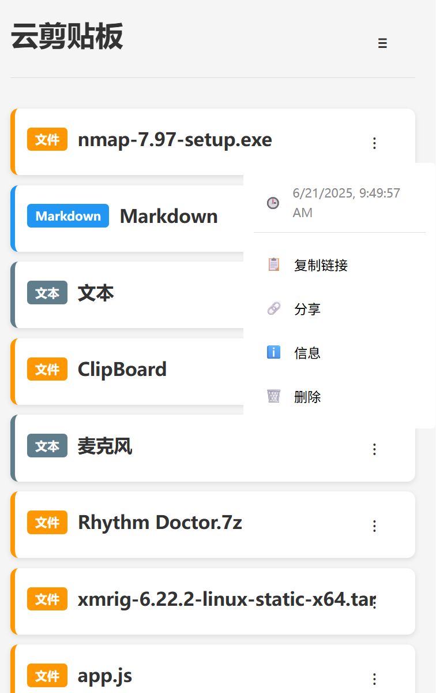

# PasePad云剪贴板应用

PasePad是一个基于Node.js和SQLite的云剪贴板应用，支持多种内容类型的存储和管理。版本1.1.0增加了更多功能和配置选项。









## 功能特点

- **多种内容类型支持**：
  - **富文本(Markdown)**：使用Vditor编辑器，支持预览、复制、编辑和删除
  - **纯文本**：支持预览、复制、编辑和删除
  - **链接**：支持直接跳转、复制和删除
  - **文件**：支持下载、复制链接和删除，并提供文件信息查看
- **内容管理**：每种类型使用不同颜色标识，便于区分
- **分享功能**：可以生成分享链接，分享给他人查看内容
- **认证机制**：通过URL参数密码进行简单认证，认证后可以编辑和删除内容
- **响应式设计**：适配不同设备屏幕大小
- **文件同步功能**：支持自动同步数据库与文件系统，可配置同步策略
- **支持文件自动转换**：支持将TXT文件自动转换为纯文本，将MD文件自动转换为Markdown
- **会话管理**：使用express-session实现认证状态保持，无需重复认证

## 安装与运行

### 前提条件

- Node.js (v14.0.0或更高版本)
- npm (v6.0.0或更高版本)

### 安装步骤

1. 克隆或下载项目到本地

2. 安装依赖
   ```bash
   npm install
   ```

3. 启动应用
   ```bash
   npm start
   ```

4. 打开浏览器访问 http://localhost:3000

## 使用指南

### 认证访问

- 应用默认以未认证模式运行，未认证状态下只能查看和复制内容
- 要进行认证，请在URL后添加参数：`?password=密码`，默认密码为"PasePad"
- 认证成功后，页面右上角会显示"已认证 ✓"，此时可以编辑和删除内容
- 认证状态会在会话中保持1小时，无需重复认证

### 创建新内容

1. **创建Markdown**：
   - 点击"新建Markdown"按钮
   - 输入标题和内容（使用Vditor编辑器）
   - 点击"保存"按钮

2. **创建纯文本**：
   - 点击"新建纯文本"按钮
   - 输入标题和内容
   - 点击"保存"按钮

3. **创建链接**：
   - 点击"新建链接"按钮
   - 输入标题和URL
   - 点击"保存"按钮

4. **上传文件**：
   - 点击"新建文件"按钮
   - 输入标题（可选，默认使用文件名）
   - 选择要上传的文件
   - 点击"上传"按钮

### 内容操作

- **查看内容**：
  - 点击内容卡片可展开查看详细内容
  - 对于文件，可以查看文件信息和预览（支持文本文件预览）

- **复制内容**：
  - 对于Markdown和纯文本：点击"复制"按钮复制全部内容
  - 对于链接：点击"复制"按钮复制链接URL
  - 对于文件：点击"复制链接"按钮复制文件下载链接

- **分享内容**：
  - 点击"分享"按钮生成分享链接
  - 分享链接可以发送给他人，无需认证即可查看内容

- **编辑内容**（需认证）：
  - 对于Markdown和纯文本：点击"编辑"按钮修改内容
  - 链接和文件不支持编辑

- **删除内容**（需认证）：
  - 点击"删除"按钮删除内容
  - 删除文件时，服务器上的文件也会被删除

### 管理功能

认证后，可以访问管理页面进行高级设置：

1. **访问管理页面**：
   - 认证后，访问 `/admin` 路径进入管理页面

2. **认证配置**：
   - 修改认证密码

3. **上传目录配置**：
   - 设置文件上传目录和Vditor上传目录
   - 支持相对路径和绝对路径

4. **文件同步**：
   - 数据库与文件系统的同步
   - 设置文件自动转换选项（TXT转纯文本、MD转Markdown）
   - 设置文件转换的大小限制


## 项目结构

```
.
├── app.js              # 应用入口文件
├── package.json        # 项目依赖配置
├── config.json         # 应用配置文件
├── clipboard.db        # SQLite数据库文件（自动创建）
├── public/             # 静态资源
│   └── css/
│       └── style.css   # 样式文件
├── uploads/            # 上传文件存储目录（自动创建）
├── vditoruploads/      # Vditor编辑器上传文件目录（自动创建）
├── docs/               # 文档和截图
│   ├── mainpage.png    # 主页面截图
│   └── text.png        # 文本编辑截图
└── views/
    ├── index.ejs       # 主页面模板
    ├── share.ejs       # 分享页面模板
    └── admin.ejs       # 管理页面模板
```

## 许可证

GPLv3